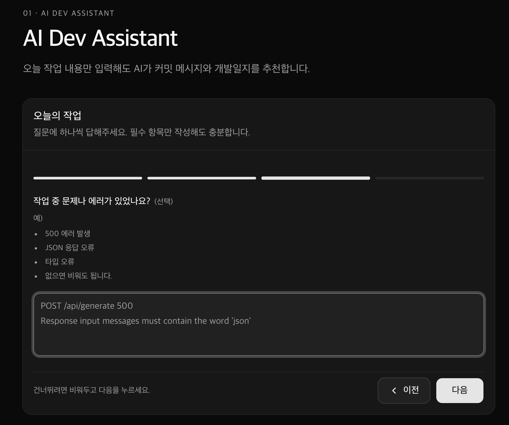

# AI Dev Assistant

AI를 활용해 **오늘 작업한 내용을 커밋 메시지와 개발일지로 정리**하는 개발자 생산성 도구입니다.

---

## ✨ Why?

개발을 마친 뒤

- 커밋 메시지를 고민하고
- 개발일지를 정리하고
- 오늘 무엇을 했는지 다시 떠올리는 일은

생각보다 많은 시간이 듭니다.

AI Dev Assistant는
**오늘 작업한 내용을 입력하면**
커밋 메시지와 개발일지를 추천하여
기록에 드는 시간을 줄여주는 것을 목표로 합니다.

---

## 🚀 Features

- AI 커밋 메시지 추천
- AI 개발일지 추천
- Markdown 복사
- 더 자세하게 작성하기
- Route Handler 기반 OpenAI 연동

---

## 🛠 Tech Stack

- Next.js(App Router)
- TypeScript
- Tailwind CSS
- shadcn/ui
- OpenAI Responses API

---

## 📸 Screenshot

---

## 🎯 Future Plans

- Prompt Engineering 고도화
- 개발일지 품질 개선
- 입력 UX 개선
- 배포(Vercel)
- GitHub OAuth
- 커밋 로그 자동 분석