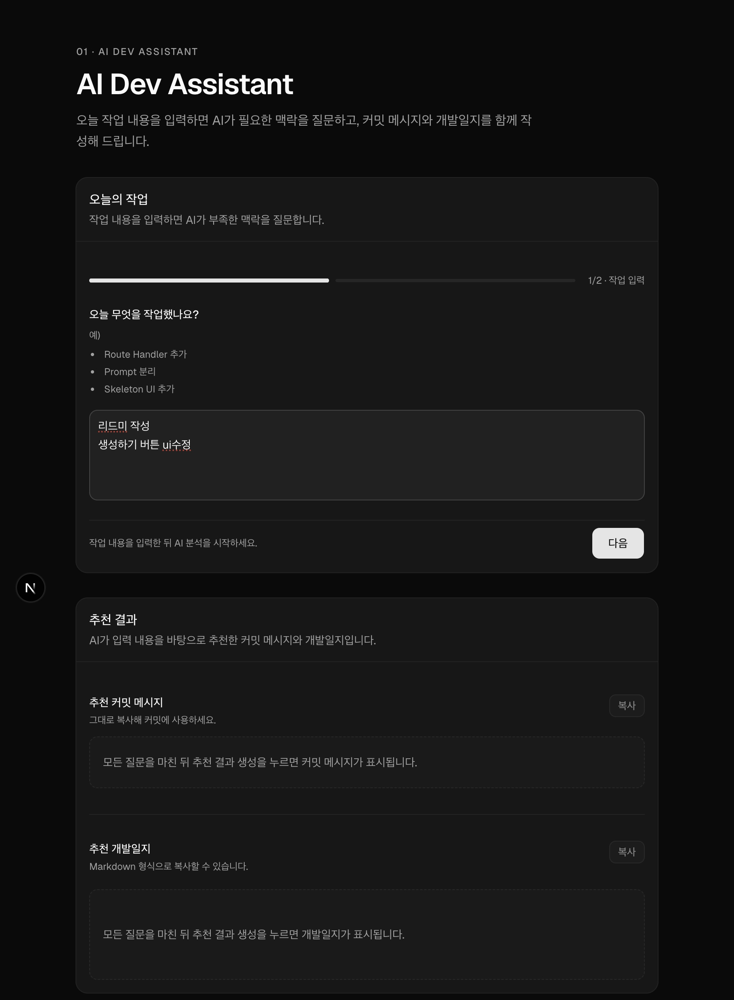
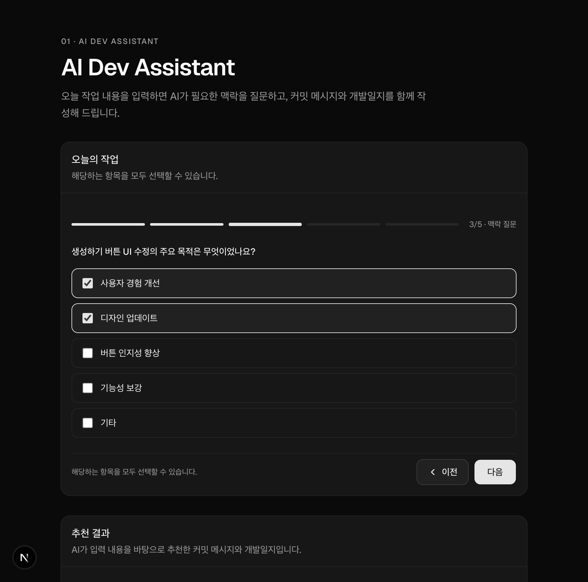
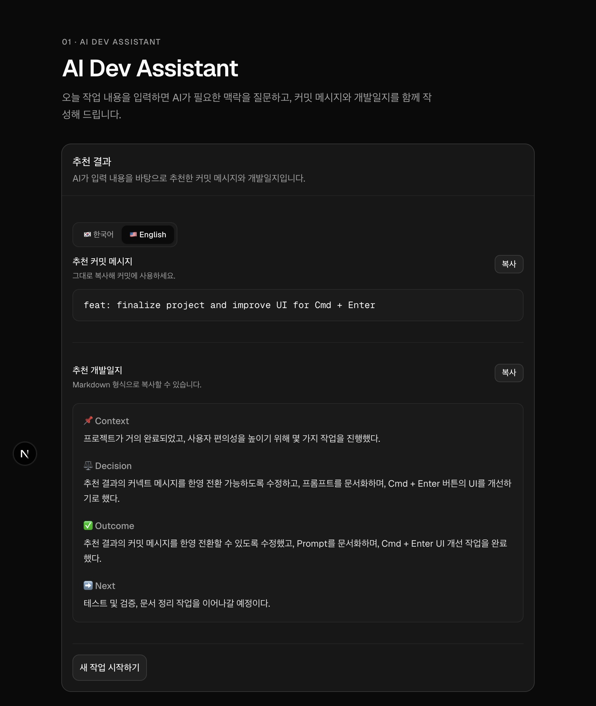
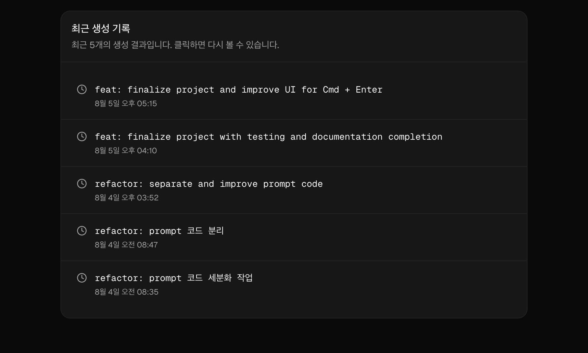

← [Back to Repository](../../README.md)

## 🌐 Live Demo

https://ai-dev-assistant-v1.vercel.app

# AI Dev Assistant

AI를 활용해 오늘 작업한 내용을 기반으로

- Commit Message
- Development Journal

을 생성하는 개발자 생산성 도구입니다.

---

## ✨ Why?

개발을 마친 뒤

- 커밋 메시지를 작성하고
- 개발일지를 정리하고
- 오늘 무엇을 했는지 다시 떠올리는 과정은

생각보다 번거롭습니다.

AI Dev Assistant는

짧은 작업 내용을 입력하면

커밋 메시지와 개발일지를 추천하여

기록에 드는 시간을 줄이는 것을 목표로 만들었습니다.

---

## 🚀 Features

- AI Commit Message 생성
- AI Development Journal 생성
- 단계형(Wizard) 기반 입력
- Markdown 복사
- Local Draft 저장
- History 저장
- Skeleton Loading
- Toast 알림
- Cmd/Ctrl + Enter 단축키

---

## 🛠 Tech Stack

### Frontend

- Next.js (App Router)
- TypeScript
- Tailwind CSS
- shadcn/ui

### AI

- OpenAI Responses API

---

## 📁 Project Structure

```
app/
components/
lib/
docs/
```

---

## 🚀 Getting Started

```bash
pnpm install

pnpm dev
```

---

## 📸 Screenshots

### Main



---

### Wizard



---

### Result



---

### History



---

## 🤔 Limitations

프로젝트를 진행하면서 가장 크게 느낀 점은

Prompt만으로는 사용자가 실제 수행한 작업을 모두 복원하기 어렵다는 것이었습니다.

사용자는 대부분

```
Prompt 코드 분리
```

처럼 핵심 키워드만 입력하는 경우가 많았습니다.

이 경우 AI는 입력된 사실만을 기반으로 개발일지를 작성해야 하기 때문에
실제 개발 과정보다 단순한 결과가 생성되는 한계를 확인했습니다.

이 문제를 해결하기 위해서는

Git Diff

Commit 변경 내역

파일 변경 정보

등을 함께 활용하는 방식이 더 적합하다는 결론을 얻었습니다.

이번 프로젝트에서는 해당 기능까지 구현하지 않고
현재 구조를 하나의 MVP로 마무리하기로 결정했습니다.

---

## 📚 What I Learned

- Prompt Engineering
- OpenAI Responses API
- Wizard UI 설계
- Prompt 구조 리팩토링
- AI 결과 품질 개선 과정

## 📌 Status

✅ MVP Completed

현재는 기능 추가보다

프로젝트를 안정적으로 마무리하고

다음 프로젝트(Pet Routine Manager)를 진행하는 것을 우선 목표로 합니다.
